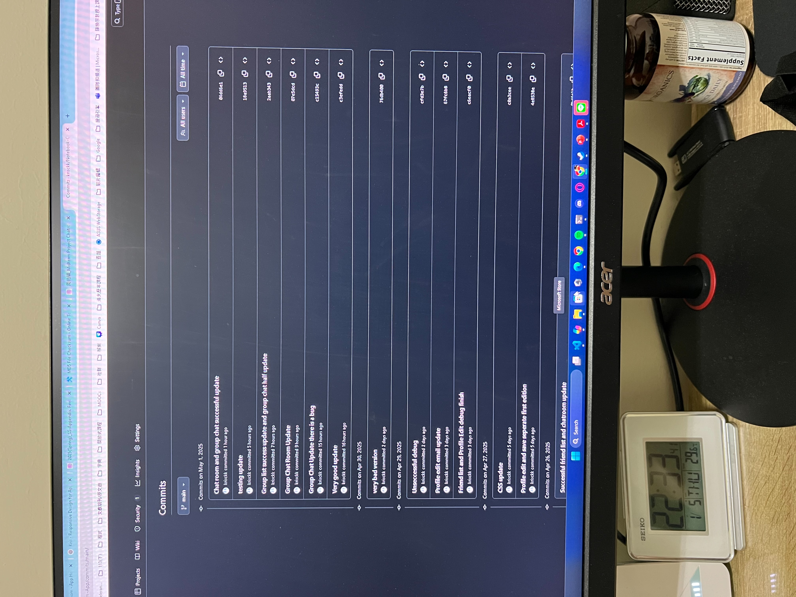

# Notebook Chatroom App

A React + Firebase-powered chat application with one-on-one and group chat support, friend management, and profile editing. This README outlines the project structure and describes each major function and component.

---

## 🗂️ File Structure

```
src/
├─ Notebook.js         # Root component, handles page flipping and auth state
├─ firebase.js         # Firebase initialization (auth + Firestore)
├─ Page.js             # Renders individual pages (sign‑in, sign‑up, friends, chat, profile)
├─ FriendsList.js      # Manages friend search, add, remove, and selection
├─ ChatRoom.js         # One‑to‑one chat UI and message handling
├─ ProfileEditor.js    # Load, edit, and save user profile (displayName, bio, email, phone, address)
├─ GroupList.js        # Create new group chats (auto‑includes friends) and list them
├─ GroupChat.js        # Group chat UI, sends/deletes messages
├─ generateRoomId.js   # (helper) deterministic roomId between two user UIDs
└─ Page.css            # Common page styles

firestore.rules        # Security rules for Firestore (profiles, friends, groups, chatrooms)
```

---

## 📦 Components & Functions

### `Notebook.js`
- **Notebook**: Top‑level component that:
  - Listens to Firebase `onAuthStateChanged` to track `user`.
  - Manages flip animations between left/right pages.
  - Holds `currentFriend` and `currentGroup` state.
  - Passes props (`user`, `content`, `onSelectGroup`, etc.) to two `<Page side="left"/>` and `<Page side="right"/>` instances.

---

### `firebase.js`
- **`auth`**: Firebase Auth instance (`getAuth()`).
- **`provider`**: Google auth provider.
- **`db`**: Firestore instance (`getFirestore()`).

---

### `Page.js`
- **Page**: Renders based on `content.type`:
  - **`signin`**: shows email/password form and Google sign‑in button. Functions:
    - `handleEmailSignIn(e)`: calls `signInWithEmailAndPassword`; on success, calls `onToggleSignUp(false)`.
    - `handleGoogle()`: calls `signInWithPopup`; on success, clears the sign‑up flag.
  - **`signup`**: shows email/password sign‑up form. Function:
    - `handleSignup(e)`: calls `createUserWithEmailAndPassword`, initializes user doc, then clears flip flag.
  - **`friends`**: shows `<FriendsList>` and `<GroupList>` side by side.
  - **`chat`**: shows `<ChatRoom>` for one‑to‑one messaging.
  - **`profile`**: shows `<ProfileEditor>`.
- Accepts props like `currentFriend`, `currentGroup`, `onSelectGroup`, `onToggleSignUp`, flip handlers, etc.

---

### `FriendsList.js`
- **FriendsList({ user, onFriendSelect, onProfileToggle })**:
  - **`useEffect`**: subscribes to `/users/{user.uid}/friends` via `onSnapshot`, sets `friends` state.
  - **`handleAdd(e)`**: searches Firestore `users` collection by displayName, then `addDoc` to the friends subcollection.
  - **`handleRemove(friendId)`**: deletes the friend doc via `deleteDoc`.
  - Renders search form, list of friends (`<li>` clickable to select), and delete icons.

---

### `ChatRoom.js`
- **ChatRoom({ user, roomId, friend })**:
  - **`useEffect`**: subscribes to `/chatrooms/{roomId}/messages` ordered by timestamp, updates `messages`.
  - **`handleSend(e)`**: `addDoc` a new message with fields `{ text, sender, senderId, receiver, receiverId, timestamp }`.
  - Renders message bubbles with sender name/time, delete icon on your own messages, and input box.
  - **`handleDelete(messageId)`**: calls `deleteDoc` on the message path.

---

### `ProfileEditor.js`
- **ProfileEditor({ user, onReturn })**:
  - **`useEffect`**: loads `/users/{user.uid}` doc; if missing, creates one with default fields.
  - **`compressImage(file)`**: client‑side downscales an uploaded avatar.
  - **`handleSave(e)`**: `setDoc` merges updated profile fields (`displayName`, `bio`, `photoDataUrl`, `email`, `phone`, `address`).
  - Toggles between view and edit modes; shows avatar upload, input fields, and save button.

---

### `GroupList.js`
- **GroupList({ user, onSelectGroup })**:
  - **`useEffect`**: subscribes to `/users/{user.uid}/groups`.
  - **`handleAddClick()`**: shows inline input for new group name.
  - **`commitEntry(tempId, name)`**:
    1. loads all friend UIDs from `/users/{uid}/friends`
    2. builds `members = [...friendUids, user.uid]`
    3. `addDoc` under your `/users/{uid}/groups`
    4. mirrors that same doc under each `/users/{friendUid}/groups/{newGroupId}` via `setDoc`
  - Renders group list items, each clicking calls `onSelectGroup(group)`.

---

### `GroupChat.js`
- **GroupChat({ group, user, onExit })**:
  - **`useEffect`**: subscribes to `/users/{leader}/groups/{groupId}/messages`.
  - **`handleSend(e)`**: `addDoc` a message `{ text, senderId, senderName, timestamp }`.
  - **`handleDelete(messageId)`**: `deleteDoc` on the message doc.
  - Renders message bubbles with name/time and delete icon for your own messages, plus an exit button.

---

## 🔒 Firestore Rules (`firestore.rules`)
- **Profiles**: `/users/{userId}` read by any authenticated user; write only by the user.
- **Friends**: subcollection write and delete only by the owning user.
- **Groups**:
  - creation allowed when `request.auth.uid == request.resource.data.leader`.
  - read/update/delete allowed if `auth.uid == userId` **or** in `resource.data.members`.
- **Group Messages**: `/users/{userId}/groups/{groupId}/messages/{msgId}` read/create allowed for any `members`.
- **Chatrooms**: two‑person chats under `/chatrooms/{roomId}` with ID format `uid1-uid2`; read/write only for the two participants; message deletes restricted to the sender.

---
### git
